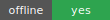
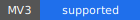
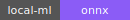
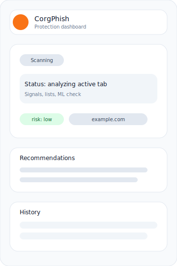
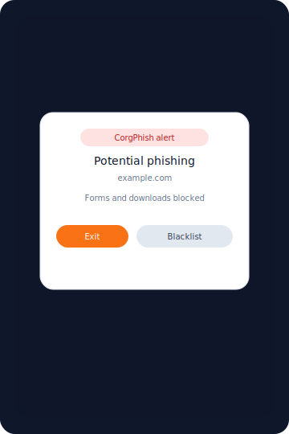
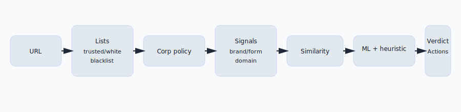

# CorgPhish

CorgPhish — локальное расширение против фишинга для Chrome/Chromium. Работает офлайн и не отправляет данные наружу.

CorgPhish is a local anti‑phishing extension for Chrome/Chromium. It runs fully offline with no external requests.

<p align="left">
  
  
  
  <a href="https://github.com/physcorgi/CorgPhish2/actions/workflows/build.yml">
    
  </a>
</p>

- [Русский](#русский)
- [English](#english)

## Screenshots / Скриншоты

<p align="left">
  
  
</p>

## How it works / Как работает



## Русский

### О проекте
CorgPhish проверяет URL при открытии страницы, сопоставляет домен с trusted/whitelist/blacklist, ищет признаки подмены (бренд‑упоминания, подозрительные формы, похожие домены), а затем запускает локальную ML‑модель. При высоком риске включается блокировка форм и загрузок.

### Быстрый старт
1. Откройте `chrome://extensions`.
2. Включите **Developer mode**.
3. Нажмите **Load unpacked** и выберите папку `CorgPhish/`.
4. Обновите вкладку с сайтом и откройте попап расширения.

### Возможности
- Офлайн‑проверка HTTP/HTTPS страниц.
- trusted.json + пользовательские whitelist/blacklist.
- BrandGuard: поиск упоминаний брендов на странице.
- Form Action Guard: анализ доменов, куда отправляются формы.
- Похожесть доменов (Левенштейн + бренд‑токены).
- Локальный ML‑инференс (onnxruntime‑web) с эвристическим фоллбеком.
- Блокировка форм/скачиваний на опасных страницах.
- История проверок, фильтры, ручная проверка доменов.

### Структура репозитория
- `CorgPhish/` — код расширения (MV3).
- `.github/` — шаблоны Issues/PR.
- `README.md`, `LICENSE`, `CHANGELOG.md` — документация и метаданные.

### Документация
- Полная техническая документация: `CorgPhish/README.md`.
- Гайд по релизу: `RELEASING.md`.

### Сборка локально
```bash
./scripts/verify.sh
./scripts/package.sh
```

### Лицензия
MIT — см. `LICENSE`.

## English

### About
CorgPhish inspects URLs on page load, checks trusted/whitelist/blacklist, detects spoofing signals (brand mentions, suspicious form actions, domain similarity), then runs a local ML model. High‑risk pages are blocked for forms and downloads.

### Quick start
1. Open `chrome://extensions`.
2. Enable **Developer mode**.
3. Click **Load unpacked** and select the `CorgPhish/` folder.
4. Reload a target tab and open the extension popup.

### Features
- Offline scanning of HTTP/HTTPS pages.
- trusted.json + user whitelist/blacklist.
- BrandGuard: brand mention detection on page.
- Form Action Guard: checks form submission domains.
- Domain similarity (Levenshtein + brand tokens).
- Local ML inference (onnxruntime‑web) with heuristic fallback.
- Blocking of forms/downloads on risky pages.
- Scan history, filters, manual domain checks.

### Repository layout
- `CorgPhish/` — extension code (MV3).
- `.github/` — Issue/PR templates.
- `README.md`, `LICENSE`, `CHANGELOG.md` — docs and metadata.

### Documentation
- Full technical documentation: `CorgPhish/README.md`.
- Release guide: `RELEASING.md`.

### Local build
```bash
./scripts/verify.sh
./scripts/package.sh
```

### License
MIT — see `LICENSE`.
