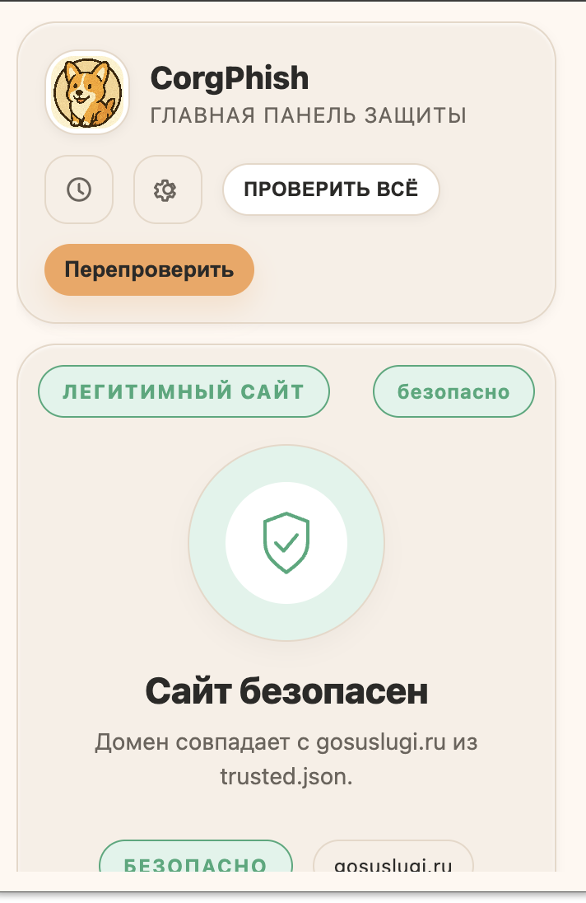
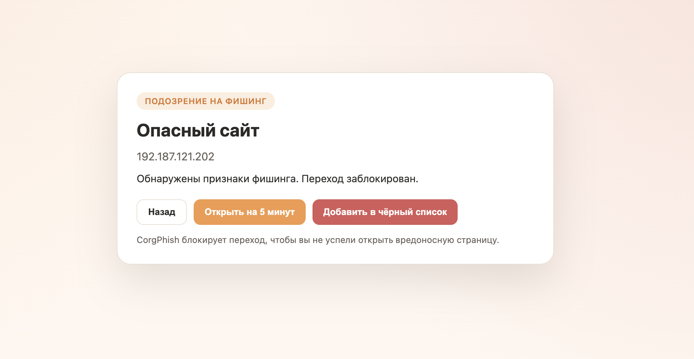
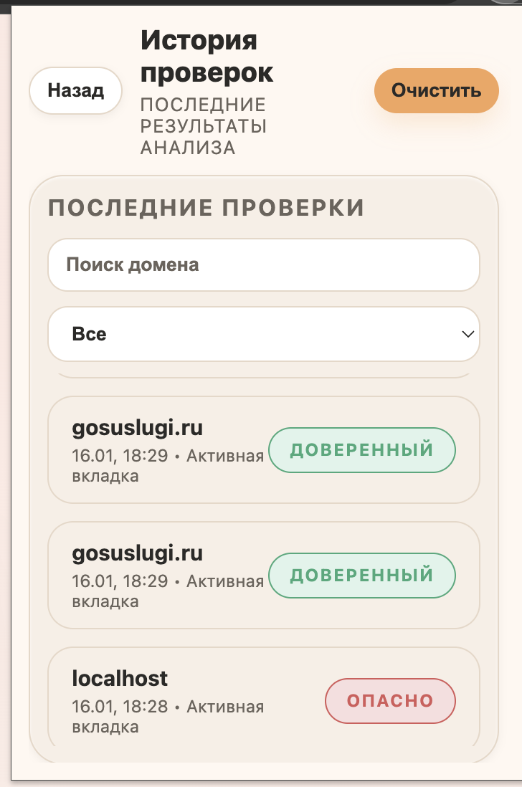
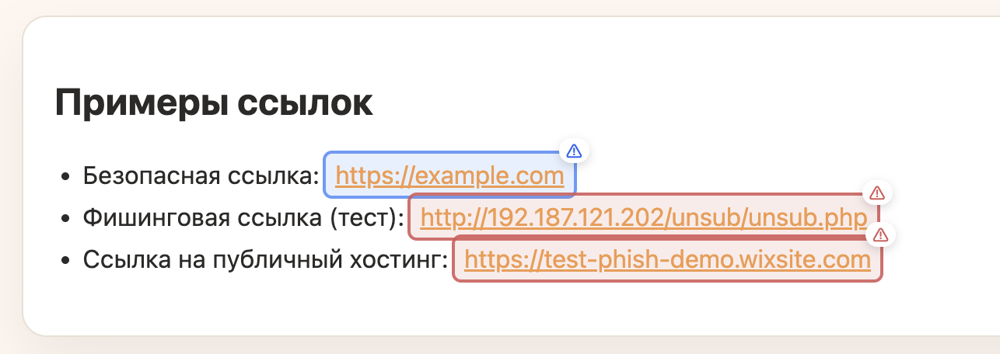

# CorgPhish

Локальное расширение для Chrome/Chromium, которое проверяет сайты на признаки фишинга, подмены домена, рискованные формы, опасные ссылки и загрузки прямо в браузере.

<p align="left">
  <a href="https://github.com/CorgPhish/CorgPhish2/actions/workflows/build.yml">
    
  </a>
  
  
  
  <a href="LICENSE">
    
  </a>
</p>

## Возможности

- проверка домена по `trusted.json`, белому и чёрному спискам;
- анализ похожести домена на известные бренды;
- локальная ML-проверка URL и fallback на эвристику;
- анализ форм, контента страницы и редиректов;
- блокировка отправки данных и скачивания файлов;
- экран полной блокировки для опасных действий;
- история проверок и быстрые действия в popup;
- полностью локальная работа без обязательного внешнего сервера.

## Быстрый старт

1. Откройте `chrome://extensions`.
2. Включите `Developer mode`.
3. Нажмите `Load unpacked`.
4. Выберите папку `CorgPhish/`.
5. Закрепите расширение в панели браузера.

После установки откройте popup и при необходимости включите:

- автопроверку при открытии страницы;
- подсветку ссылок;
- строгий режим;
- блокировку ввода и загрузок.

## Пользовательская документация

- Полное руководство пользователя: [docs/user-guide.md](docs/user-guide.md)
- Результаты и методика тестирования: [docs/testing/README.md](docs/testing/README.md)
- Навигация по проекту: [docs/navigation.md](docs/navigation.md)
- Карта файлов: [docs/project_map.md](docs/project_map.md)
- Структура репозитория: [docs/structure.md](docs/structure.md)

## Скриншоты

<p align="left">
  
  
  
  
  
</p>

Дополнительно:

- demo-страница для проверки блокировки: [docs/demo-blocking/index.html](docs/demo-blocking/index.html)
- demo-страница для ссылок: [docs/beta/index.html](docs/beta/index.html)

## Как работает расширение

1. `content script` получает URL и сигналы текущей страницы.
2. Домен нормализуется и сравнивается с `trusted.json`, пользовательским белым и чёрным списками.
3. Если совпадения нет, включаются проверки похожести домена, брендовых сигналов, форм и контента.
4. Затем выполняется локальный ML-анализ через `background` + `offscreen`.
5. Если ML недоступна, решение дополняется fallback-эвристикой.
6. На выходе расширение выносит один из verdict:
   - `trusted`
   - `suspicious`
   - `phishing`
   - `blacklisted`
7. Для опасных сценариев расширение блокирует сайт, форму или скачивание и переводит пользователя на безопасный экран.

## Структура проекта

- `CorgPhish/` — исходники расширения.
- `CorgPhish/popup/` — popup, настройки, storage, ML и итоговый verdict.
- `CorgPhish/src/content/` — модульные исходники контент-скрипта.
- `CorgPhish/content.js` — итоговый собранный content script.
- `CorgPhish/background.js` — service worker.
- `CorgPhish/offscreen.js` — локальный ONNX inference.
- `CorgPhish/blocked.*` — экран блокировки.
- `CorgPhish/trusted.json` — встроенный trusted-список.
- `CorgPhish/models/` — локальная ONNX-модель.
- `tests/` — unit и integration тесты.
- `scripts/` — сборка, проверка и упаковка.
- `docs/` — документация, скриншоты, тестовые материалы.
- `.github/` — CI/CD и Dependabot.

## Локальная разработка

Минимальный цикл:

```bash
./scripts/build-content.sh
npm test
./scripts/verify.sh
```

Упаковка релизного архива:

```bash
./scripts/package.sh
```

Результат:

- ZIP-архив создаётся в `dist/`
- итоговый файл имеет вид `dist/corgphish-release-vX.Y.Z.zip`

## Тесты

Доступные команды:

```bash
npm test
npm run test:unit
npm run test:integration
npm run test:coverage
```

В репозитории уже есть:

- unit-тесты на логику доменов, риск-скор, списки, fallback и storage;
- integration runner на 348 сценариев;
- test helpers и mock для `chrome.*`.

## CI/CD

В репозитории настроены два workflow:

- `.github/workflows/build.yml`
- `.github/workflows/release.yml`

Что делает `build.yml`:

1. checkout репозитория;
2. установка Node.js;
3. `npm ci`;
4. `npm test`;
5. `./scripts/verify.sh`;
6. `./scripts/package.sh`;
7. публикация ZIP как artifact.

Что делает `release.yml`:

1. запускается по тегу `vX.Y.Z`;
2. повторно ставит зависимости;
3. прогоняет тесты и verify;
4. собирает ZIP;
5. создаёт GitHub Release и прикладывает архив.

## Что нужно включить на GitHub

Для корректной работы CI/CD в анонимном репозитории должны быть включены:

- `Settings -> Actions -> General -> Allow all actions and reusable workflows`
- `Settings -> Actions -> General -> Workflow permissions -> Read and write permissions`
- `Settings -> General -> Default branch -> main`

Если релизы не нужны автоматически, можно использовать только `build.yml`.

## Порядок релиза

1. Обновить версию в `CorgPhish/manifest.json`.
2. Обновить `docs/meta/CHANGELOG.md`.
3. Запустить локально:

```bash
npm test
./scripts/verify.sh
./scripts/package.sh
```

4. Создать тег:

```bash
git tag vX.Y.Z
git push
git push --tags
```

5. Дождаться workflow `Release Extension`.

Подробно: [docs/meta/RELEASING.md](docs/meta/RELEASING.md)

## Где что менять

- trusted-список: `CorgPhish/trusted.json`
- итоговый verdict: `CorgPhish/popup/inspection.js`, `CorgPhish/popup/inspection-core.js`
- ML и эвристика: `CorgPhish/popup/model.js`, `CorgPhish/popup/model-core.js`, `CorgPhish/offscreen.js`
- popup UI: `CorgPhish/popup.html`, `CorgPhish/popup.css`, `CorgPhish/popup/ui.js`
- блокировка форм и скачиваний: `CorgPhish/src/content/05-blocking-init-and-events.js`
- экран блокировки: `CorgPhish/blocked.html`, `CorgPhish/blocked.css`, `CorgPhish/blocked.js`

## Дополнительные документы

- История изменений: [docs/meta/CHANGELOG.md](docs/meta/CHANGELOG.md)
- Релизный процесс: [docs/meta/RELEASING.md](docs/meta/RELEASING.md)
- Политика безопасности: [docs/meta/SECURITY.md](docs/meta/SECURITY.md)
- Contribution guide: [CONTRIBUTING.md](CONTRIBUTING.md)

## Лицензия

[MIT](LICENSE)
